今天心血来潮打算仔细学习一下git的使用，之前只是浅尝辄止没能应用起来，隔一段时间就生疏了,想要学好一件事物必须得用上它。
为了以后的独立工作，必须得将这项技能掌握好。
## git的意义在于
1. 版本控制：git可以记录文件的历史版本，方便回退到之前的状态，避免数据丢失。
2. 协作开发：git可以方便地与他人合作开发，避免冲突，提高开发效率。
3. 分支管理：git支持多分支管理，方便开发人员在不同功能之间切换，避免代码冲突。
4. 回滚操作：git可以方便地回滚到之前的版本，避免因为错误操作导致的问题。
5. 分支合并：git可以方便地合并不同分支的代码，避免代码冲突。
发现现在的ai真的很好用，写一个开头自动预测后续的内容，不知道到底是我在使用ai还是ai在使用我。但这些已经不重要了，我需要利用ai来提高效率，同时还能保持自己独立思考才是最重要的。
## 一个常见的git使用流程是这样的
1. 进入工作文件夹，创建一个新的git仓库：
markdown代码格式：
```
   git init #尝试在markdown里面写代码
```
2. 如果需要从开源项目开始就需要先克隆远程仓库：git clone url，这里的url有多种获取方式，比如https、ssh、git协议等，具体的方法就是访问项目地址，点击Code按钮，选择需要的协议方式，复制url。
图片如下：
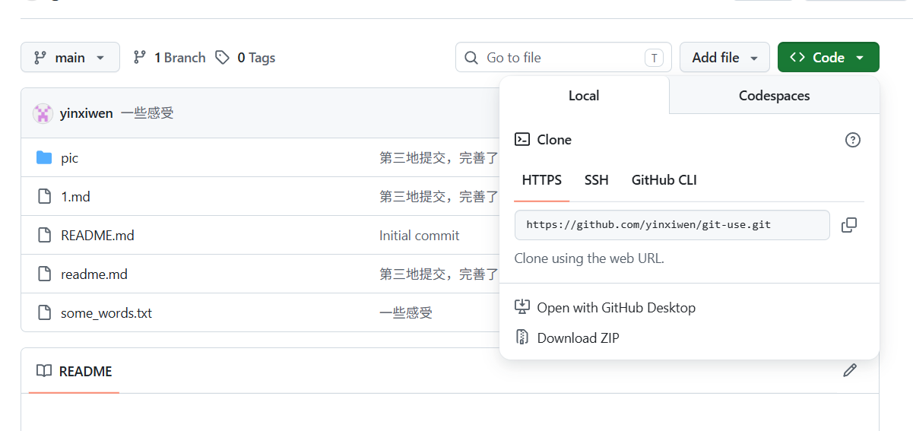
（这里插一嘴markdown的图片语法，格式是）
再来一张图片:
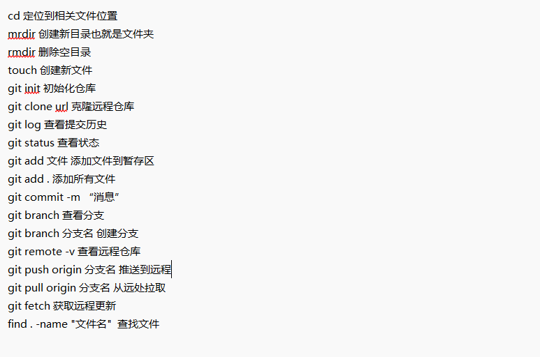
代码如下：
```
    git clone url #克隆远程仓库
```

3. 添加文件到暂存区：git add filename，或者添加所有文件：git add .，这一步是告诉git你要提交哪些文件。   
代码如下：
```
    git add filename #添加指定文件到暂存区
    git add . #添加所有文件到暂存区
```
实际测试：
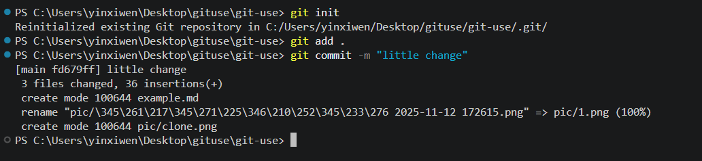
(刚才犯了一个错误，我不应该在git clone之前创建一个文件夹的并且初始化git仓库的，这样会导致两个仓库冲突，于是我直接进入克隆的文件夹，初始化git仓库，然后添加文件到暂存区，最后提交到远程仓库。)
4. 提交文件到本地仓库：git commit -m "commit message"，这一步是告诉git你要提交的文件的描述信息，方便以后查看历史版本。
代码如下：
```
    git commit -m "message"
```
5. 推送文件到远程仓库：git push origin branch_name，这一步是告诉git你要将本地仓库的文件推送到远程仓库的哪个分支。默认是main分支。代码如下：
```
    git push -u origin main #触发登录认证然后就可以推送了
```
同时再推送之前需要配置git的用户名和邮箱，代码如下：
```
    git config --global user.name "your name"
    git config --global user.email "your email"
```
查看结果如下：
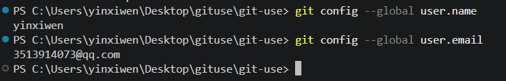
(语法细节真的很重要，每个空格和括号都很重要)
推送结果如下：
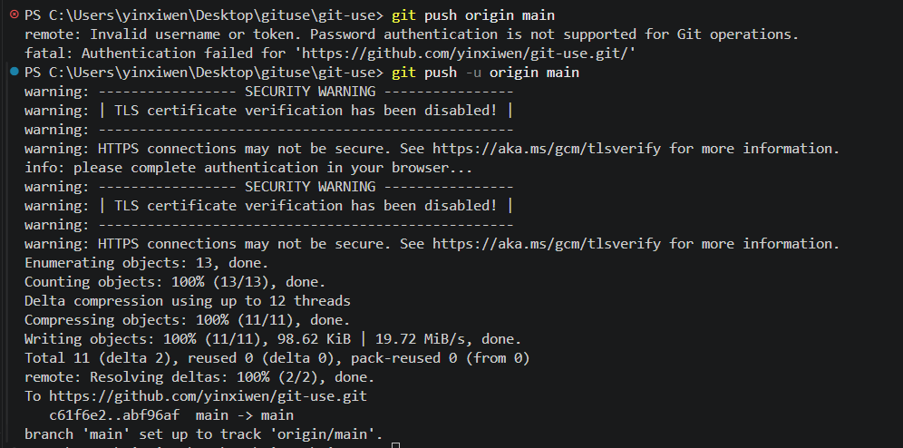
再看看GitHub上的效果：
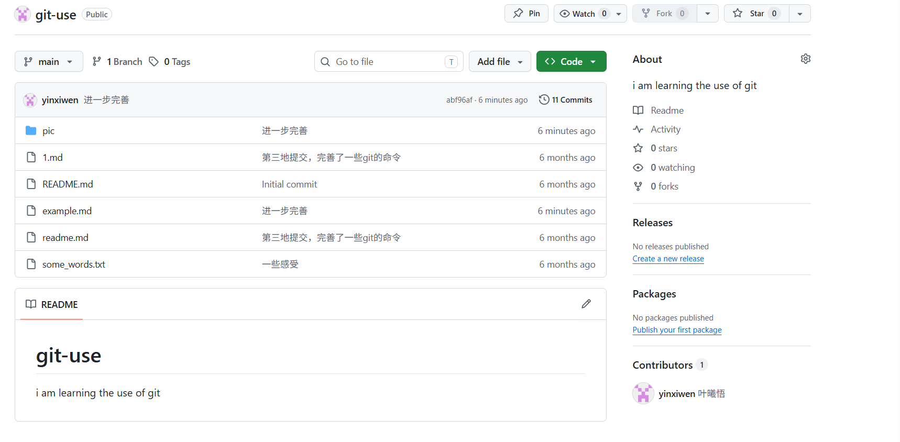
## 好神奇！！！
## 进阶学习
1. 分支管理：
   原因：为了在不同功能之间切换，避免代码冲突。
   git branch branch_name创建分支，git checkout branch_name切换分支，git merge branch_name合并分支。
    代码如下：
    ```
        git branch branch_name #创建分支
        git checkout branch_name #切换分支
        git merge branch_name #合并分支
    ```
测试结果：
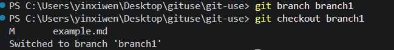
接着提交分支到远程仓库：
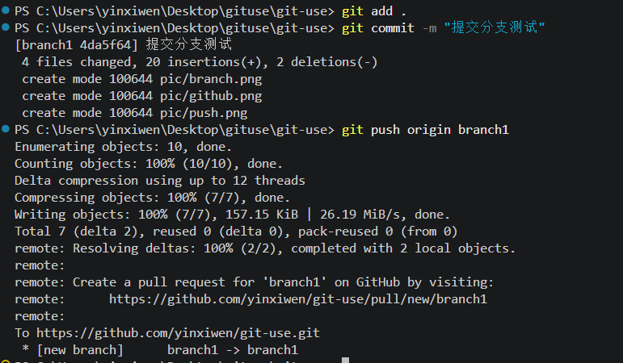
github效果如下：
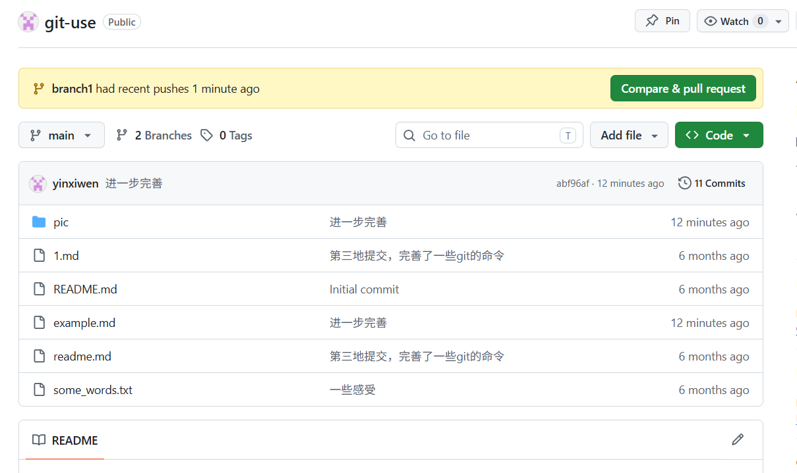
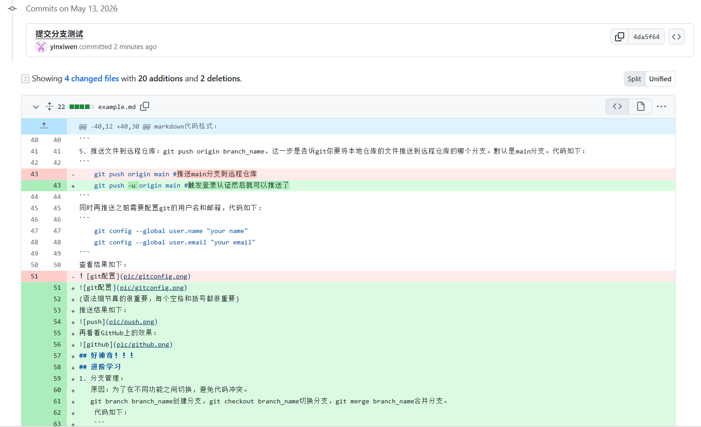
接下来合并分支：
代码如下：
```
    git checkout main #切换到main分支
    git merge branch_name #合并分支
```
测试结果：
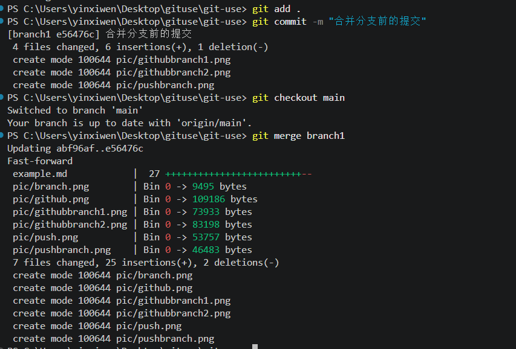
github效果如下：
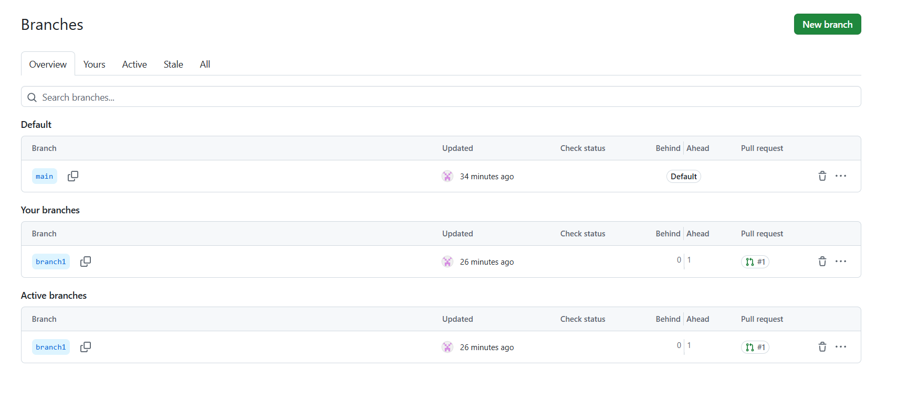
两种不同的合并方式：
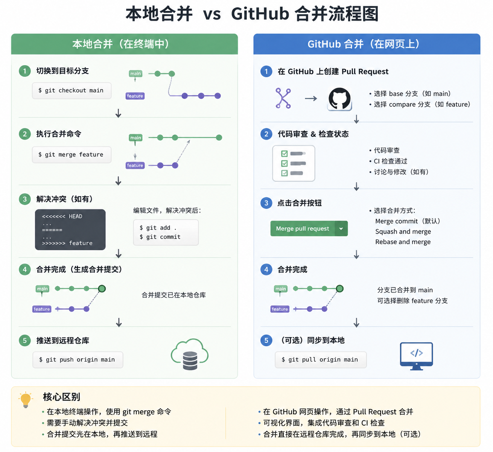
2. 回滚操作：
   原因：为了避免因为错误操作导致的问题。
   git reset --hard commit_id回滚到指定版本，git revert commit_id回滚到指定版本并生成一个新的提交。
    代码如下：
```
    git reset --hard commit_id #回滚到指定版本,前提是关闭所有未提交的文件
    git revert commit_id #回滚到指定版本并生成一个新的提交
```
操作结果如下：
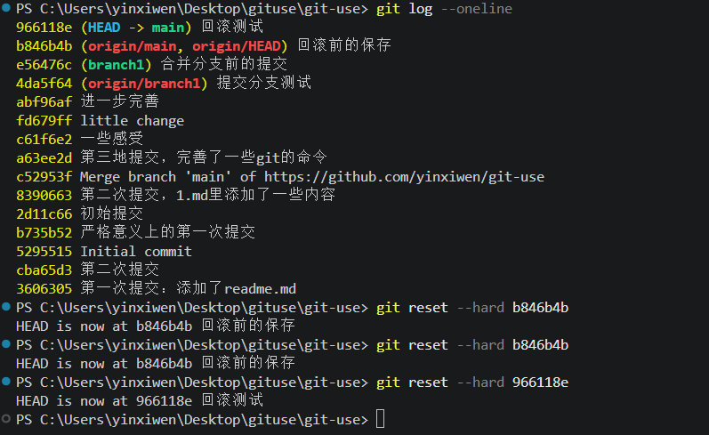
3. 日志查看：
    原因：为了查看历史版本，方便回滚操作。
    git log查看所有提交记录，git log --oneline查看所有提交记录的简略版本。
    代码如下：
```
    git log #查看所有提交记录
    git log --oneline #查看所有提交记录的简略版本
    git log --oneline --graph #查看所有提交记录的简略版本并显示分支图
```
操作结果如下：
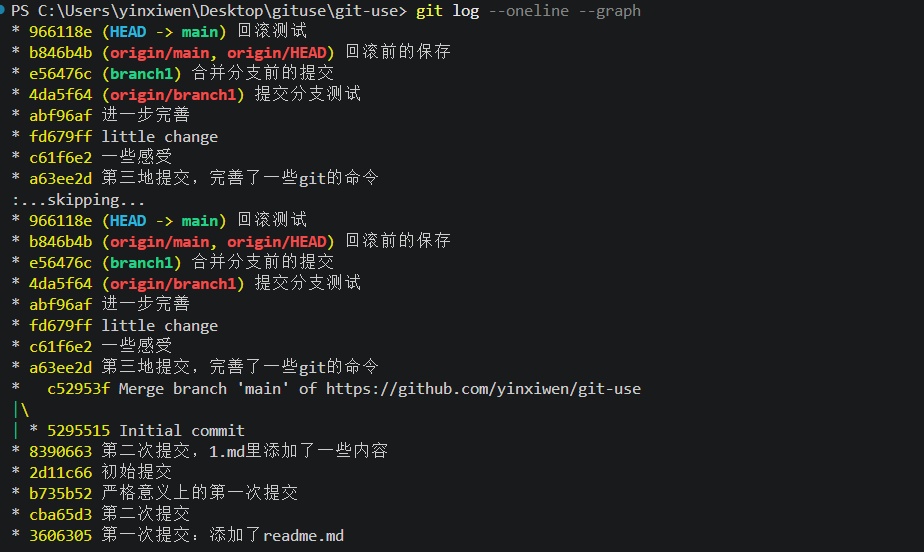 

## 总结
1. git init初始化git仓库
2. git clone url克隆远程仓库
3. git add filename添加文件到暂存区
4. git add .添加所有文件到暂存区
5. git commit -m "message"提交文件到本地仓库
6. git push -u origin branch_name推送文件到远程仓库
7. git branch branch_name创建分支
8. git checkout branch_name切换分支
9. git merge branch_name合并分支
10. git reset --hard commit_id回滚到指定版本,前提是关闭所有未提交的文件
11. git revert commit_id回滚到指定版本并生成一个新的提交
12. git log查看所有提交记录
13. git log --oneline查看所有提交记录的简略版本
14. git log --oneline --graph查看所有提交记录的简略版本并显示分支图
